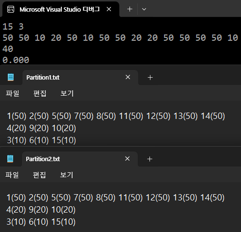
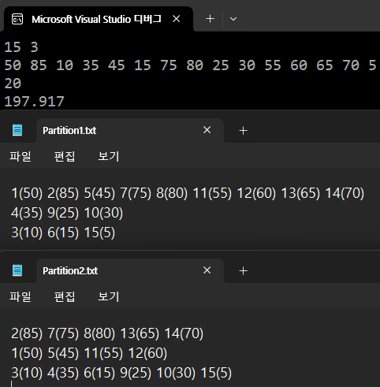
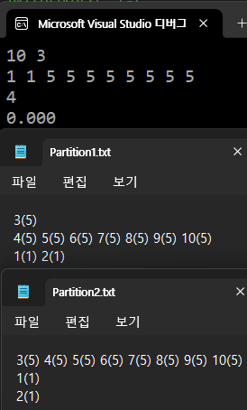

## HW2 보고서 2020203090 한용옥
## 실행환경
### 언어 : `c++20`
### 컴파일러 및 IDE : Microsoft Visual Studio Community 2022 버전 17.13.6

## 입력, 데이터 처리

`method1, 2` 모두 **점수** 를 기준으로 분할 하지만, 파일 출력은 **학번** 순으로 해야하므로 점수와 학번을 모두 연산 전 보존하여야한다
본 프로그램에서는 `using student = pair<int, int>;`를 사용하여 학생 데이터를 점수와 학번 쌍으로 간주하고 정렬, 계산에 이용한다
이하 서술에서 점수로 정렬, 점수로 분할, 학번 순 정렬 등등 은 모두 `student`형 을 가지고 연산하는 것이다

```cpp
//입력 처리
int n, k, temp; cin >> n >> k; vector<student> s_v;
for (int i = 0; i < n; i += 1)
    { cin >> temp; s_v.push_back(pair{ i + 1, temp }); }
//함수 실행
method1(s_v, k);
method2(s_v, k);
```

입력된 데이터는 `(학번, 점수)` 형태로 배열에 담기게 되고 각 메서드에 넘겨 실행한다
메서드는 복사본을 받기 때문에 같은 배열에 대해 독립적으로 실행 가능하다

## Method 1

점수가 높은 학생이 앞쪽 그룹에 있어야 하므로 최적 분할은 연속구간 분할이다
[증명 보기](#부록-a)

따라서 $\min{g_i} - \max{g_{i+1}}$ 는 $s_{k} - s{k+1}$ 형태 일 수 밖에 없다

내림차순 정렬된 데이터 $s_1, s_2, ..., s_n$ 에 대해
연속된 데이터의 차이 즉 $s_{i} - s_{i+1}$ 을 모두 구한 뒤, 차이가 큰 상위 `k-1` 개 뽑아 그 인덱스로 분할 하면 된다

### 구현

#### 전체 절차

`method1` 는 입력으로 학생데이터 `s_v`와 그룹 수 `k`를 받아 아래를 실행한다

0. 들어온 입력 정렬
1. 입력 배열을 순회하며 연속된 두 값의 차이와 인덱스를 `diff`에 저장
2. `diff`에서 값이 큰 상위 `k-1`개를 뽑음
3. 뽑힌 인덱스로 원본 배열을 분할, 학번 순 정렬
4. 출력

아래는 각 절차에 대한 상세 설명이다

#### `diff` 배열 생성
```cpp
vector<student> diff;
for (int i = 0; i < s_v.size() - 1; i += 1) {
    int s_v_diff = s_v[i].second - s_v[i + 1].second;
    if (s_v_diff == 0) continue;
    diff.push_back(student{ i + 1, s_v_diff }); }
```
차이 값 배열을 만드는 과정이다 
다음 값이 현재 값과 다르다면 차이를 `diff`에 저장한다
이 때 분할 편의를 위해 같은 값이 끝나는 지점 + 1 인덱스를 저장한다

#### 상위 `k-1` 개 뽑기
`diff` 는 차이값 배열이다 즉 `diff` 에서 상위 `k-1`개를 고르면

#### 분할 및 구간 학번순 정렬
실제로 배열을 분할해 따로 저장하지 않고 인덱스를 이용해 그 구간만 학번 순으로 정렬하여 분할 된 것 같은 효과를 낸다

```cpp
for (int i = 0; i < end_idx.size() - 1; i += 1)
    ranges::sort(s_v.begin() + end_idx[i], s_v.begin() + end_idx[i + 1],
                 less(), &student::first);
```
위 명령어를 이용해 앞 단계에서 구한 구간별로 학번이 정렬된다

#### 출력

콘솔에 구한 최대값을 표시하고
앞에서 구한 구간 인덱스를 이용해 `학번(점수)` 형식으로 파일 저장한다

### 시간복잡도 분석

#### 정렬

입력인 $n$ 개의 데이터를 정렬 `std::ranges::sort`는 $O(n \log n)$ 이므로
$O(n \log n)$

#### 인접 차이 계산

배열을 순회하며 각 원소 차이값, 인덱스만 추가 하므로 $O(n)$  

#### 상위 k개 추출

`std::partial_sort`의 시간복잡도는 $O(n \log k)$ 이다
힙을 사용해 정렬 대상 상위 $k$ 개 원소를 유지하며 전체 $n$ 개를 처리하는 방식이다
$O(n \log k)$

#### 분할 및 구간 학번 순 정렬

$k$ 개로 나눴으므로 그룹 별 데이터 개수는
$n_1, n_2, ... , n_k$ 개(모두 더하면 $n$) 이다
그룹 별로 정렬하고 $n_i < n$ 이므로 전체 시간복잡도는
$$
\sum_{i=1}^{k}O(n_i \log n_i) < \sum_{i=1}^{k}O(n_i \log n) = O(n \log n)
$$

따라서 $O(n \log n)$ 

#### 출력

원본 배열을 순회하며 한 원소를 출력하기만 하므로
시간복잡도는 $O(n)$

### 전체 과정을 종합하면 `method1` 시간복잡도 $O(n \log n)$

## Method 2

#### 보조정리 1
내림차순 정렬 배열 $S$ 에 대해 그룹의 분산의 합이 최소가 되게 한 분할을 $P$ 라 하면
$P$ 의 모든 원소는 연속 $S$ 원소의 열이다 

보조정리 1 증명 : [부록 보기](#부록-b)

보조정리 1 덕분에 최적 분할은 연속 구간의 모음이므로
마지막 구간이 어디서 시작되는지를 바탕으로 한 점화식을 세울 수 있다
|용어|정의|
|--:|:--|
|$\{s_1,s_2,...,s_{n}\}$|내림차순 된 데이터 $n$ 개|
|$Var(a,b)$|$s_a,s_{a+1},...,s_{b}$ 들의 분산|
|$V(k,i)$|데이터 $s_1,s_2,...,s_{i}$를 $k$개 최적 분할 할 때의 분산값|

최적 분할은 연속구간 형태이므로 어떤 데이터의 $k$ 개 최적 분할을 보면
마지막 그룹을 제외한 나머지 데이터는 그들의 $k-1$ 개 최적 분할이다
(그렇지 않으면 그들의 $k-1$ 개 분할로 대체 한 것이 전체 최적이므로)

각 구간에는 한 개 이상의 데이터가 있어야 하므로
맨 끝 그룹이 가를 수 있는 지점의 범위는 $[k-1, i)$ 이다
따라서 점화식은 아래와 같다

$$
V(k,i) = \min_{t \in [k-1, i)} {(V(k-1,t) + Var(t+1, i))}
$$

이는 최적 분산값이므로 진짜로 분할하기 위해 각 단계 분할 최적 인덱스인 $t$ 를 저장해야한다
따라서 최적 인덱스를 아래와 같이 정의한다
$$
T(k,i) = \underset{t \in [k-1, i)}{arg min} {(V(k-1,t) + Var(t+1, i))}
$$

정의에 의해 $T(k-1, T(k,i))$ 는 끝에서 두 번째 그룹의 시작 인덱스를 결정하므로
재귀 형태로 분할 인덱스를 추적 가능하다

`method2` 는 $n$ 개의 데이터를 $k$ 개 최적 분할 하는 것이 목표이므로
$V(k,n)$ 을 구하고 $T(k,i)$ 를 추적해가며 인덱스를 구한 후 분할하고
각 분할을 학번 순 정렬하면 된다 

### 구현

위 점화식을 바탕으로한 동적계획법을 메모이제이션으로 구현하였다

#### 전체 절차

`method2` 는 입력으로 학생데이터 `s_v`와 그룹 수 `k`를 받아 아래를 실행한다

0. 들어온 입력 정렬
1. 누적합, 누적제곱합 배열 초기화
2. 값 배열 $V$, 인덱스 추적 배열 $T$ 생성, $V(k,i)$ 경계값 처리
3. 메모이제이션으로 $V,T$ 계산
4. 분할 인덱스 추적
5. 분할 및 구간 학번순 정렬
6. 출력

아래는 각 절차에 대한 상세 설명이다

#### 누적합, 누적제곱합 배열 초기화 -> 분산을 $O(1)$ 에 구하기
$$
sum(n) = \sum_{i=1}^{n}{s(i)} \quad ssum(n) = \sum_{i=1}^{n}{s(i)^2}
$$

위 누적합, 누적 제곱합을 미리 준비해두면

$$
Var(a,b) = \text{제곱의 평균} - \text{평균의 제곱}
$$

$$
= \frac{ssum(b)-ssum(a-1)}{b-a+1} - \left(\frac{sum(b)-sum(a-1)}{b-a+1}\right)^2
$$

이므로 $Var(a,b)$ 를 $O(1)$ 에 구할 수 있다

본 프로그램에선 `double var(int start, int end, ...sum, ...sum2)` 가 누적 합, 제곱합 배열을 이용하여 $Var(start,end)$ 를 $O(1)$ 에 계산한다

#### 값 배열 $V$, 인덱스 추적 배열 $T$ 생성, $V(k,i)$ 경계값 처리

$V,T$ 는 이차원 함수이므로 이 값들을 기록하기 위해 이차원 배열
`vector<vector<double>> V, vector<vector<int>> T` 를 생성한다
`V, T` 의 크기는 `k * n`이다

배열 인덱스는 `0`부터 시작하므로 `V[k-1][i-1]` = $V(k,i)$ 이다

$V(1,i)$ 는 $i$ 개를 그룹 1개로 분할한다는 뜻으로 분할하지 않을 때의 최적 분산값과 같다
$V(1,i) = Var(1,i)$ 이므로 반복문으로 `V[0][i]` 들을 `var`을 이용해 채운다

#### 메모이제이션으로 $V, T$ 계산
```cpp
void method2_recur(vector<vector<double>>& V,
                   int k, int i,
                   vector<vector<int>>& T,
                   const vector<long long>& sum, const vector<long long>& sum2)
{
    //계산되어있으면 바로 종료
    if (V[k][i] >= 0) return;

    //점화식
    double result = numeric_limits<double>::infinity();
    int opt = 0;
    for (int t = k - 1; t < i; t += 1)
    {
        //점화식 적용전 해당 값이 계산되어야함
        method2_recur(V, k - 1, t, T, sum, sum2);
        double temp = V[k - 1][t] + var(t + 1, i, sum, sum2);
        if (temp <= result)
        {
            result = temp;
            opt = t;
        }
    }
    //배열 값 갱신
    T[k][i] = opt;
    V[k][i] = result;
}
```

점화식을 재귀함수로 구현하여 모든 가능한 $V$, 그에 대한 인덱스 $T$ 를 계산한다

```cpp
if (V[k][i] >= 0) return;
```
종료조건은 이미 $V(k,i)$ 가 계산되어 있을 때이다
앞 단계에서 경계값 `V[0][i]`들을 채우고 점화식 형태에 의해 `k`가 감소하므로
종료조건은 위 조건으로 충분하다

```cpp
for (int t = k - 1; t < i; t += 1) {
    method2_recur(V, k - 1, t, T, sum, sum2);
    double temp = V[k - 1][t] + var(t + 1, i, sum, sum2);
    if (temp <= result) { result = temp; opt = t;} }
T[k][i] = opt; V[k][i] = result;
```

위 코드 조각이 $V$ 의 점화식을 구현한 코드이다 
`t` 에 대한 반복문으로 $\min_{t \in [k-1, i)}$ 을 구현한다
먼저 함수를 재귀호출해 사용할 $V$ 값을 계산하고 $(V(k-1,t) + Var(t+1, i))$ 값 중
가장 작은 값을 저장하여 `V, T`배열에 갱신한다

종료조건에 의해 재귀함수로 `V` 배열의 값은 한 번 만 계산된다

#### 분할 인덱스 추적

정의에 의해 $T(k-1, T(k,i))$ 식으로 다음 인덱스들을 알아 낼 수 있다
```cpp
void track_opt_idx(const vector<vector<int>>& T, int k, int i, vector<int>& result) {
    if (k <= 0) return;
    int opt = T[k][i];
    result.push_back(opt + 1);
    track_opt_idx(T, k - 1, opt, result); }
```
위 재귀 함수로 외부 배열에 분할 기준 인덱스를 넣는다
$T$ 의 정의에 의해 분할의 마지막 그룹의 시작 인덱스는 $T$ 의 값에 1을 더한 것이므로 그 값을 저장한다
프로그램에서는 `opt_idx`에 저장된다

#### 분할 및 구간 학번순 정렬

실제로 배열을 분할해 따로 저장하지 않고 인덱스를 이용해 그 구간만 학번 순으로 정렬하여 분할 된 것 같은 효과를 낸다

```cpp
for (int i = 0; i < opt_idx.size() - 1; i += 1)
    ranges::sort(s_v.begin() + opt_idx[i], s_v.begin() + opt_idx[i + 1],
                 less(), &student::first);
```
위 명령어를 이용해 앞 단계에서 구한 구간별로 학번이 정렬된다

#### 출력

콘솔에 구한 최대값을 표시하고
앞에서 구한 구간 인덱스를 이용해 `학번(점수)` 형식으로 파일 저장한다

### Method 2 시간복잡도 분석

#### 누적합, 누적제곱합 배열 초기화
길이가 $n$ 인 배열 각각의 원소를 누적해가며 더하는 것으로
$O(n)$ 이다

#### 값 배열 $V$, 인덱스 추적 배열 $T$ 생성, $V(k,i)$ 경계값 처리
길이가 $n$ 인 배열 각각의 원소에 $Var$ 값을 부여하는 작업이다
`var` 의 시간복잡도는 $O(1)$ 이므로 이 작업의 시간복잡도는 $O(n)$ 이다

#### 메모이제이션으로 $V,T$ 계산

```cpp
void method2_recur(...) {
    //종료 조건
    if (V[k][i] >= 0) return;
    //이하 계산
    int opt = 0; double result = numeric_limits<double>::max();
    for (int t = k - 1; t < i; t += 1) {
        method2_recur(V, k - 1, t, T, sum, sum2);
        double temp = V[k - 1][t] + var(t + 1, i, sum, sum2);
        if (temp <= result) { result = temp; opt = t; } }
    T[k][i] = opt; V[k][i] = result; }
//실제 호출
method2_recur(V, k - 1, size - 1, T, sum, sum2);
```

`method2_recur` 는 `V` 가 계산되어있으면 바로 종료되고
계산되어있지 않을 때(= 처음 접근할 때) 만 아래 내용을 수행한다

실제 호출시 데이터 개수 $n$ , 그룹 수 $k$ 를 넣어 호출한다
함수 내 반복문과 재귀호출로 인해 본 재귀함수는 모든 가능한 $V(a, b)$ 를 계산한다 ($a \in [0,k), b \in [0,n)$)

간단한 증명
>$V(k, n)$ 가 본 함수에 의해 계산되었을 때
>호출되지 않은 상태 $V(a, b)$ 가 있다고 가정 ($a \in [0,k), b \in [0,n)$)
>점화식 구현 정의($k-1$ 재귀 호출)에 따라 $V(a+1, b), ..., V(k−1, b)$ 는 
>$V(a, b)$ 가 필요하므로 계산될 수 없다
>$V(k−1, b)$ 가 계산되지 않는다면 함수의 `for` 문에서 $V(k−1, t)$ 를 이용해 $V(k, n)$ 을 계산할 수 없으므로
>$V(k, n)$ 역시 계산되지 않는다
>이는 최초 가정과 모순이므로 모든 $V(a, b)$ 는 반드시 계산된다

비록 구현상으로는 반복문 내부에서 재귀 호출이 중첩되어 있으나
종료 조건을 통해 각 값 $V(k, i)$는 단 한 번만 계산되므로

$V(k,n)$을 계산할 때의 시간복잡도는
모든 가능한 $V(a, b)$ 에 대한 계산시 `for` 반복 횟수 합이다
각 상태에서 반복은 $i-k+1$ 번 실행된다
분산계산도 반복항에 있지만 누적배열로 $O(1)$ 에 구할 수 있어 무시된다 
따라서 반복과 계산 상태 개수만 신경쓰면 된다
이를 고려한 수식은 아래와 같다

$$
\sum_{b=1}^{k} \sum_{a=b}^{n-1} (a - b + 1) \in O(kn^2)   
$$

#### 수식 전개
[부록 보기](#부록-c)

#### 분할 인덱스 추적

최적 분할의 인덱스는 `k-1` 개 이므로 재귀함수는 `k-1` 번 반복한다
시간복잡도 : $O(k)$

#### 분할 및 구간 학번 순 정렬

$k$ 개로 나눴으므로 그룹 별 데이터 개수는
$n_1, n_2, ... , n_k$ 개(모두 더하면 $n$) 이다
그룹 별로 정렬하고 $n_i < n$ 이므로 전체 시간복잡도는
$$
\sum_{i=1}^{k}O(n_i \log n_i) < \sum_{i=1}^{k}O(n_i \log n) = O(n \log n)
$$

따라서 $O(n \log n)$ 

#### 출력
원본 배열을 순회하며 한 원소를 출력하기만 하므로
시간복잡도는 $O(n)$

### 전체 과정을 종합하면 `method2` 시간복잡도 $O(kn^2)$

## 논의 : `method2` 에 대한 제약조건 풀이

### 제약 1

>같은 점수인 학생은 반드시 같은 그룹에 속해야 함

#### 접근

같은 점수는 같은 그룹이어야하므로 같은 점수끼리 묶어 압축한 배열에 대해 `method2`를 적용하면 된다
그러면 자연히 경계는 같은 값이 아니게 되는 지점으로 정해지고 같은 점수가 쪼개지지 않는다

구체적으로 다음 절차를 따르면 된다

0. 입력 데이터 배열을 정렬한다
1. 배열 데이터를 순회하며 바로 뒤에 다른 값이 있을 경우
`core`에 현재 값, 값 시작 인덱스, 끝 인덱스를 저장한다
2. 입력으로 들어온 그룹 개수 `k`에 대해 `core`의 길이가 `k`보다 작으면 예외처리한다
3. 진행 가능하면 `method2`의 나머지 절차를 진행한다

같은 점수는 분할 불가이므로 2번 절차를 통해 `k`개로 분할 불가할 때 예외처리 해야한다

#### 구현시 달라져야 할 부분

누적합, 누적제곱합 배열 초기화 후(원본 으로 만든 배열 사용, 따라서 안바뀌어도 됨)
`core`를 생성하는 아래 의사코드를 구현해 넣어야한다
```python
for i in range(len(input)):
    start = 0
    if input[i] != input[i + 1] or i + 1 is out of range:
        core.append((input[i], start, i))
        start = i + 1
```

이후 `len(core) < k` 이면 분할 불가이므로 예외처리 구문을 넣어야한다 아래를 구현하여 넣는다
```python
if len(core) < k:
    raise("분할 불가")
```

누적합, 누적제곱합을 이용해 분산을 구하는 `var`도 바뀌어야한다
대상 배열이 원본이 아닌 `core`로 달라졌기 때문이다

이후 값 배열과 추적 배열을 `core`의 길이에 맞게 초기화한다

`method2`구현에 따라 분산을 구하는 구간은 **모두 연속구간** 이다
`core`의 연속구간은 모두 입력의 연속구간이므로 위에서 `core`에 저장한 `start, i`를 이용하면 누적합, 누적제곱합을 원본으로 부터 구할 수 있다

```cpp
for (int t = k - 1; t < i; t += 1) {
    method2_recur(V, k - 1, t, T, sum, sum2);
    double temp = V[k - 1][t] + var(core[t + 1].start, core[i].end, sum, sum2);
    if (temp <= result) { result = temp; opt = t; } }
```

위 코드 같이 분산을 계산할 때 저장했던 `start, end`를 넘겨주면 분할은 `core`단위로 하되 분산은 실제 원본 배열의 구간으로 계산 하므로 제약을 지키면서 최선의 분할을 찾을 수 있다

인덱스 추적으로 얻은 배열 `idx`에 대해 아래 의사코드를 수행한다
```python
for i in idx:
    i = core[idx].start
```
인덱스 추적으로 얻은 인덱스는 이미 그룹 끝의 다음 원소를 가리키므로 원복시킬때는 `start`로 해야 의도대로 돌아간다

#### 시간복잡도 변화

`core`를 만드는 작업이 추가 되었고 메모이제이션 대상이 `core`로 변화하였다
`core`생성은 배열을 순회하며 각 원소마다 조건 검사, `core`에 값 추가만 하므로
시간복잡도 : $O(n)$ 이다

k는 불변이지만 `n = len(core)` 로 변화하였다 $l = |core|$ 라 하자
메모이제이션 시간복잡도는 $O(kl^{2})$ 이다

나머지 절차는 동일하다 따라서 $O(kl^{2})$ 를 제외한 나머지 지배항은 정렬 시간인 $O(n \log n)$ 이다

$$
kl^2 = n \log n \rightarrow l = \sqrt{\frac{1}{k} n \log n} 
$$

이므로 $l$ 이 저 값보다 작을 때 `method2`는 $O(nlogn)$
크면 $O(kl^2)$ 이다

### 제약 2

>그룹별 학생 수에 대한 제한
>예를 들어, 1번 및 2번 그룹의 학생 수 총합이 전체 학생 수(n)의 30%를 초과할 수 없다
>또한, 1~4번 그룹의 학생 수 총합이 전체의 70%를 초과할 수 없다
>학생들은 이와 같은 누적 인원 제한 조건을 위반하지 않도록 할당되어야 한다
>이러한 조건을 만족하는 구성을 찾지 못할 경우 불가능함을 감지하고 보고해야 한다

#### 접근

점화식에 검사항을 추가하여 인원 수를 직접 체크하면 된다
예시 기준을 적용한다고 가정하자

$$
V(k,i) = \min_{t \in [k-1, i)} {(V(k-1,t) + Var(t+1, i))}
$$

현재 점화식은 내림차순 배열에 대해 마지막 그룹이 언제 시작되는지로 가른다
이는 곧 마지막 그룹, 점수가 가장 낮은 학생들의 그룹을 결정하는 형태이다

우리는 상위 그룹의 인원제한이 제약이므로 내림차순이 아닌 오름차순으로 점수를 정렬해두면
점화식 구조가 상위학생의 그룹을 정하는 형태로 쓸 수 있다
따라서 일단 오름차순으로 정렬해야 한다

점화식의 $k$ 에 집중해보자 $V(k, i)$ 를 구할 때 $V(k-1, i)$ 와 그룹의 분산을 이용해 구한다
이를 잘 보면 첫 번째 그룹이 어디서 시작해야하는지 탐색하는 과정인 것이다
일반화 하여 $V(k-(a-1), i)$ 를 구할 때 $V(k-a, i)$ 와 그룹의 분산을 이용해 구한다
이 단계에서는 $a$ 번째 그룹이 어디서 시작해야하는지 탐색하는 과정인 것이다

따라서 단계에 인원제한이 있다면 $a$번째 단계에서 $a$ 와 `min`내부 반복 인덱스를 이용해 그룹 인원수를 측정 할 수 있다

점화식은 `min`기반이므로 점화식 `min`내부에 조건 항을 추가해서 인원제한이 넘어가는 것은 모두 무한 값 처리하면 선택 될 일이 없어진다
그럼에도 불구하고 구하고자 하는 $V(k,n)$ 의 값이 무한으로 계산되었다면 제약 2를 만족하는 분할은 없다
이므로 분할 못한다고 처리하면 된다

구체적으로 아래 함수를 점화식에 넣으면 된다

|용어|정의|
|--:|:--|
|$Rate(a)$|그룹 $1$ 부터 그룹 $a$까지의 누적 제한 비율 $Rate(2) = 0.3$ -> $1,2$그룹 인원 제한이 30퍼센트라는 뜻|
|$K$|최종 그룹의 수|
|$N$|학생 인원 수|
|$Check(k, i)$|점화식 내부에 쓰일 함수로 현재까지 그룹 인원 수가 누적 비율을 넘어서면 무한 값 처리|

$$
Rate(a) = \begin{cases}
0.15 & a = 1 \\\\
0.3  & a = 2 \\\\
0.5  & a = 3 \\\\
0.7  & a = 4 \\\\
1    & a > 4
\end{cases} \quad
Check(k, i) = \begin{cases}
\infty & N - i > N \cdot Rate(K-k) \\\\
0      & \text{otherwise}
\end{cases}
$$

$$
V(k,i) = \min_{t \in [k-1, i)} {(V(k-1,t) + Var(t+1, i) + Check(k, t))}
$$

위와 같이 점화식을 구현하면 특정 $a$ 단계를 구할 때 인덱스 $t$가 의미하는 것은 $a$ 번째 그룹은
$t+1$ 부터 라는 뜻이고 따라서 $1$ 부터 $a$ 번째 그룹의 인원 합이 $n-t$ 라는 것으로 이를 미리 설정한 누적 인원 제한 비율 $Rate(a)$ 과 비교하는 $Check(k, i)$ 를 통해 현 단계 인원이 제한 비율을 넘어서면 무한 값을 대입해 선택이 안되게 된다

따라서 제약 2를 만족하면서 최적해를 구하게 된다
불가능한 경우 $V(k,n)$ 가 무한값이므로 불가능한지도 알 수 있다

#### 구현시 달라져야 할 부분

$Rate(a), Check(k,i)$ 를 그대로 구현에 점화식에 넣으면 된다

```cpp
double Rate(int a) {
    switch (a) {
    case 1:
        return 0.15
    case 2:
        return 0.3
    ...
    default:
        return 1
    } }

double Check(int k, int i, int K, int N) {
    return N - i > N * Rate(K - k) ? numeric_limits<double>::infinity() : 0; }

//점화식 변경 부분
for (int t = k - 1; t < i; t += 1) {
    method2_recur(V, k - 1, t, T, sum, sum2, K, N); // 초기 인수 추가
    double temp = V[k - 1][t] + var(t + 1, i, sum, sum2) + Check(k, t, K, N);
    if (temp <= result) { result = temp; opt = t; } }
```
위와 같이 바꾸고 재귀함수의 인수에 초기 그룹 개수 `K`, 초기 인원수 `N`를 추가로 받으면 된다

그럼에도 불구하고 $V(k,n)$ 이 무한 값인 경우 제약2 를 지키며 분할 하는 방법이 없음을 의미하므로
`method2`절차에서 메모이제이션으로 $V(k,n)$ 을 구한 직후 값이 무한값인지 확인하여 예외처리하면 된다

```python
if V[k][n] == INF:
    raise("분할 불가")
```

#### 시간복잡도 변화

`Check(k, t, K, N), Rate(a)` 를 점화식에 넣기, 예외처리 구문만 추가되었다
`Check(k, t, K, N), Rate(a)` 는 점화식 내부 구현에 있지만 `var` 같이 $O(1)$ 이라 무시된다
예외처리도 $O(1)$ 이므로
시간복잡도는 변화 없이 $O(kn^2)$ 이다

### 제약 3

>그룹 내 점수 범위 제한
>예를 들어, 각 그룹 내 최고점과 최저점의 차이가 주어진 임계값 R을 초과할 수 없다

#### 접근

점화식에 검사 항을 추가해서 조건을 강제하면 된다

현 점화식은 아래와 같다
$$
V(k,i) = \min_{t \in [k-1, i)} {(V(k-1,t) + Var(t+1, i))}
$$
마지막 구간에 대해 분산을 검사하여 가장 작은 것을 고르는 것이다

그렇다면 마지막 구간이 조건에 맞지 않으면 무한대가 되게 조정시
`min`이 될 수 없으므로 조건을 강제로 적용하게 된다

구체적으로 아래와 같은 함수를 넣어 적용하면 된다 ($a<b$)
$$
Check(a, b) = 
\begin{cases}
\infty & Score(a) - Score(b) > R \\\\
0      & \text{otherwise}
\end{cases}
$$

전체 과정, 점화식이 연속 구간에 대해서만 고려하므로 $a<b$ 면
저 함수는 그룹 내 최고점과 최저점의 차이를 임계값과 비교하게 되는것이다

저 함수를 점화식에 넣으면 아래와 같다
$$
V(k,i) = \min_{t \in [k-1, i)} {(V(k-1,t) + Var(t+1, i) + Check(t+1, i))}
$$

$Check$ 함수로 인해 그룹 내 점수차가 임계값을 넘는 경우 무한값 처리되어 선택되지 않는다
그럼에도 불구하고 구하고자 하는 $V(k,n)$ 이 무한값이라면 이는 모든 경우가 임계값을 넘는 경우이므로
제약 3을 만족하는 경우는 없음을 의미 한다

#### 구현시 달라져야 할 부분

$Check(a, b)$ 함수를 그대로 구현해 점화식에 넣는다 또한 `method2`에 임계값이 `R`로 주어진다고 가정

```cpp
double Check(int a, int b, int R, vector<student> s_v)
{
    return s_v[a] - s_v[b] > R ? numeric_limits<double>::infinity() : 0;
}
// 메모이제이션에서 바뀌는 점화식 부분
for (int t = k - 1; t < i; t += 1) {
    method2_recur(V, k - 1, t, T, sum, sum2, R); //임계값 추가
    double temp = V[k - 1][t] + var(t + 1, i, sum, sum2) + Check(t + 1, i, R, s_v);
    if (temp <= result) { result = temp; opt = t; } }
```
위와 같이 구현하면 임계값을 넘으면 무한 값 처리 되기 때문에 `min` 에서 선택 될 일이 없다

그럼에도 불구하고 $V(k,n)$ 이 무한 값인 경우 임계값 제약을 지키며 분할 하는 방법이 없음을 의미하므로
`method2`절차에서 메모이제이션으로 $V(k,n)$ 을 구한 직후 값이 무한값인지 확인하여 예외처리하면 된다

```python
if V[k][n] == INF:
    raise("분할 불가")
```

#### 시간복잡도 변화

`Check(a, b)` 를 점화식에 넣기, 예외처리 구문만 추가되었다
`Check(a, b)` 는 점화식 내부 구현에 있지만 `var` 같이 $O(1)$ 이라 무시된다
예외처리도 $O(1)$ 이므로
시간복잡도는 변화 없이 $O(kn^2)$ 이다

### 제약 4

>각 학생은 우선순위 값 $p_i$ 를 가진다
>우선순위의 총합이 높은 그룹이 더 낮은 그룹 번호(즉, 더 좋은 등급)를 가져야 한다

#### 접근

`method2` 를 일단 적용하고
각 그룹을 우선순위 합을 기준으로 내림차순 정렬하면 된다

#### 구현시 달라져야 할 부분

기존 방식은 진짜로 분할은 안하고 구간 정렬만 해 분할 효과만 얻었다
그러나 제약 4에서는 외부기준인 우선순위가 있으므로 진짜 분할해 각 배열에 저장해야한다
아래 의사코드를 최적 인덱스를 얻은 직후 구현 해야한다
```python
# 진짜 분할 해서 넣기
for i in range(len(opt_idx)):
    a = s_v[opt_idx : opt_idx + 1]
    a = (a, sum(a.priority)) # 우선순위 정렬을 위해 합 추가
    result.append(sorted(a, by 학번오름차순))
# 우선순위로 정렬 후 출력
result.sort(by 우선순위의 합의 내림차순)
for i in result:
    file_write(i) # 파일에 적기
```

#### 시간복잡도 변화

진짜 분할하고 우선순위 합을 구한 뒤 정렬하는 절차를 거쳐야한다
분할 과정은 원본 배열을 순회하며 가르는 것으로 $O(n)$ 이다
우선순위 합도 원본 배열을 순회해가며 구하는 것으로 $O(n)$ 이다
우선순위 별 정렬 절차는 그룹 단위로 이뤄지는 것으로 $O(k \log k)$ 이다

따라서 모두 $O(kn^2)$ 를 넘지 못하므로 시간복잡도의 변화는 없이 $O(kn^2)$ 이다

## 프로그램 실행 및 출력

아래는 실행 예시이다 과제 ppt의 예시를 잘 계산하여 출력한다
또한 같은 점수의 그룹을 분할해야 할 때도 잘 작동하는 모습이다





## 부록 A

### 증명 목표

내림차순 정렬된 점수열 $S = (s_1, s_2, ..., s_n)$ 에 대해
$$
\sum_{i=1}^{k-1} \bigl(\min g_i - \max g_{i+1}\bigr)
$$  
을 최대화하도록 $k$개의 그룹 $(g_1, g_2, ..., g_k)$ 로 나눌 때  
각 그룹은 입력 내에서 연속한 데이터형태라고 가정 가능하다

### 증명

최적 분할 $\{g_1, g_2, ..., g_k\}$ 중 어떤 그룹 $g_j$ 가 비연속적이라 하자 
$g_j$ 는 $[s_a, s_b] \cup [s_c, s_d]$ 처럼 중간에 빈 구간이 있다 ($b + 1 < c$)

$S$가 내림차순 정렬이므로, $s_{b} \ge s_{b+1} \ge s_c$  
$s_{b+1}$은 $g_j$에 포함되지 않았지만 그보다 작은 값이 $g_j$에 포함돼 있다

$s_{b+1}$ 을 $g_j$ 에 포함시키고, 그보다 작은 값 $s_d$ (현재 $g_j$ 에 포함) 를 제외시키면 그룹의 $\min$ 은 같거나 커지고, $\max$ 는 같거나 작아진다.  
$\min g_j - \max g_{j+1}$ 값이 증가하거나 유지된다.

이와 같은 교환을 반복하면, 각 그룹을 연속 구간으로 바꾸더라도  
목적 함수 $\sum_{i=1}^{k-1} (\min g_i - \max g_{i+1})$ 는 줄어들지 않는다

### 결론

내림차순 정렬된 점수열에 대해, 점수차이 합을 최대로 하는 모든 그룹 분할은 연속구간 분할로 바꿀 수 있다
따라서 최적 분할문제를 풀 때 최적해가 연속구간 분할이라고 가정해도 된다

[복귀](#method-1)

## 부록 B

최적 분할에 두 그룹 $A,B$가 있고 지수 $i<j<k$ 에 대해 아래와 같으면

$$
x_i, x_k\in A,\qquad x_j\in B
$$

$A$와 $B$는 **엇갈려** 있다
이때 $x_j$를 $A$로 옮기면 전체 $\operatorname{SSE}$가 감소하여 더 나은 분할이 된다

### 증명

#### 표기   $|A|=m, |B|=n (m,n\ge2)$,   평균 $\mu_A,\mu_B$,   분산 $V_A,V_B$  

**원소 추가 ($A \to A^+$)**  

$$
V_{A^+}= \frac{m}{m+1}V_A + \frac{(x_j-\mu_A)^2}{m+1}
$$

**원소 제거 ($B \to B^-$)**

$$
V_{B^-}= \frac{n}{n-1}V_B - \frac{n (x_j-\mu_B)^2}{(n-1)^2}
$$

**분산합 변화량** $\displaystyle \Delta=(V_{A^+}+V_{B^-})-(V_A+V_B)$

$$
\Delta=-\frac{m n}{(m+1)(n-1)} (\mu_A-\mu_B) \bigl(2x_j-\mu_A-\mu_B\bigr)
$$

정렬 상태 $x_i \ge x_j \ge x_k$에서  
$\mu_A > x_j > \mu_B$ 이므로 두 괄호가 모두 양수이다.  
앞에 $-$가 곱해져 있으므로

$$
\Delta < 0
$$

즉, **엇갈린 원소를 이동하면 $\operatorname{SSE}$가 항상 감소**한다.
(따라서 최적 분할에는 엇갈림이 존재할 수 없고, 모든 그룹은 연속 구간이다.) 

### 결론

> 내림차순 정렬된 데이터의 $\operatorname{SSE}$ (또는 분산) 합을 최소화하는  
> 모든 최적 분할은 각 그룹이 **연속 구간**으로 이뤄진다

#### SSE ↔ 분산 동등성

$$
\Phi_{\text{var}}=\sum_{i=1}^{k}Var(G_i),\qquad
\Phi_{\text{sse}}=\sum_{i=1}^{k}SSE(G_i),\qquad
SSE(G_i)=|G_i| Var(G_i)
$$

원소를 하나 이동할 때 각 그룹 크기는 $\pm1$만 변하므로 $\operatorname{sign}(\Delta\Phi_{\text{var}})=\operatorname{sign}(\Delta\Phi_{\text{sse}})$  
따라서 **SSE 최소 ⇔ 분산합 최소**, 위에서 증명한 연속구간성은 두 문제에 동일하게 적용된다

### 보조공식 : 단일 원소 추가 제거 시 분산 변화

| 연산 | 새 분산 |
|------|---------|
|추가 : $A^+=A\cup\{x\}$|$\displaystyle V_{A^+}= \frac{m}{m+1}V_A + \frac{(x-\mu_A)^2}{m+1}$|
|제거 : $A^-=A\setminus\{x\}$|$\displaystyle V_{A^-}= \frac{m}{m-1}V_A - \frac{m (x-\mu_A)^2}{(m-1)^2}$|

$\operatorname{SSE}=|A|V_A$, 평균 이동량 $\mu_{A^\pm}-\mu_A=\pm\dfrac{x-\mu_A}{m\pm1}$을 전개해 얻는다

#### 1. 원소 추가 $A^+ = A \cup\{x\}$, 크기 $m+1$
평균  
$$
\mu_{A^+} = \frac{m\mu_A + x}{m+1},\qquad
\delta := \mu_A - \mu_{A^+} = - \frac{x-\mu_A}{m+1}
$$

SSE 전개 

각 $y\in A$에 대해 $(y-\mu_{A^+}) = (y-\mu_A)+\delta$

$$
SSE_{A^{+}}= \sum_{y\in A} \bigl[(y-\mu_A)+\delta\bigr]^2 +(x-\mu_{A^{+}})^2=SSE_{A} + m\delta^2 +(x-\mu_{A^+})^2
$$

보조항 계산  

$$
m\delta^2 = \frac{m\,(x-\mu_A)^2}{(m+1)^2}, \qquad
x-\mu_{A^+} = \frac{m\,(x-\mu_A)}{m+1}
\Longrightarrow
(x-\mu_{A^+})^2 = \frac{m^2\,(x-\mu_A)^2}{(m+1)^2}
$$

합치기  
$$
\operatorname{SSE}_{A^+}= mV_A + \frac{m+m^2}{(m+1)^2}(x-\mu_A)^2= mV_A + \frac{m(m+1)}{(m+1)^2}(x-\mu_A)^2= mV_A + \frac{m}{m+1}(x-\mu_A)^2
$$

분산  
$$
V_{A^+} = \frac{\operatorname{SSE}_{A^+}}{m+1} = \frac{m}{m+1}V_A + \frac{(x-\mu_A)^2}{m+1}
$$

#### 2. 원소 제거 $A^- = A \setminus\{x\}$, 크기 $m-1 (m\ge2)$
평균  
$$
\mu_{A^-} = \frac{m\mu_A - x}{m-1},\qquad \delta := \mu_A - \mu_{A^-} = \frac{x-\mu_A}{m-1}
$$

SSE 전개

$$
SSE_{A^{-}} = \sum_{y\in A^{-}} \bigl[(y-\mu_A)+\delta\bigr]^{2} = \bigl(SSE_{A} - (x-\mu_A)^2 \bigr) + (m-1)\delta^2 - 2\delta (x-\mu_A)
$$

보조항 계산
$$
(m-1)\delta^2          = \frac{(x-\mu_A)^2}{m-1}, \qquad
-2\delta\,(x-\mu_A)    = -\frac{2\,(x-\mu_A)^2}{m-1}
$$

합치기  
$$
\operatorname{SSE}_{A^-}= mV_A - (x-\mu_A)^2 - \frac{2 (x-\mu_A)^2}{m-1} + \frac{(x-\mu_A)^2}{m-1}= mV_A - \frac{m (x-\mu_A)^2}{m-1}
$$

분산  
$$
V_{A^-} = \frac{\operatorname{SSE}_{A^-}}{m-1} = \frac{m}{m-1}V_A - \frac{m (x-\mu_A)^2}{(m-1)^2}
$$

[복귀](#보조정리-1)

## 부록 C

시간복잡도는

$$
\sum_{b=1}^{k-1} \sum_{a=b}^{n-1} (a - b + 1)
$$

먼저 안쪽 합부터 계산한다  
$a - b + 1$은 $a$에 대한 1차식이므로 다음과 같이 정리할 수 있다

안쪽 합

$$
\sum_{a=b}^{n-1} (a - b + 1) \quad \text{(치환 i = a - b )}
$$

$$
= \sum_{i=0}^{n - 1 - b} (i + 1) 
= \sum_{i=1}^{n - b} i
= \frac{(n - b)(n - b + 1)}{2}
$$

따라서 전체 합은

$$
\frac{1}{2} \sum_{b=1}^{k-1} (n - b)(n - b + 1)
$$

이 식을 전개하자 $x = n - b$로 치환하면
$b = 1 \rightarrow x = n - 1 ,\quad b = k - 1 \rightarrow x = n - (k - 1)$

시그마 치환변수 $x$는 $x = n - 1$부터 $x = n - k + 1$까지 감소 따라서 전체 합은

$$
= \frac{1}{2} \sum_{x=n - k + 1}^{n - 1} x(x + 1)
$$

이를 전개하면 $ x(x + 1) = x^2 + x $ 이므로

$$
= \frac{1}{2} \left( \sum_{x=n - k + 1}^{n - 1} x^2 + \sum_{x=n - k + 1}^{n - 1} x \right)
$$

합 공식

$$
\sum_{x=a}^{b} x = \frac{(b - a + 1)(a + b)}{2}
$$

제곱합 공식

$$
\sum_{x=a}^{b} x^2 = \frac{b(b+1)(2b+1)}{6} - \frac{(a-1)a(2a-1)}{6}
$$

여기서 $a = n - k + 1$, $b = n - 1$ 계속 전개시 

$$
\sum_{b=1}^{k-1} \sum_{a=b}^{n-1} (a - b + 1)
= \frac{1}{2} \left[
\left( \sum_{x=n - k + 1}^{n - 1} x^2 \right)
+
\left( \sum_{x=n - k + 1}^{n - 1} x \right)
\right]
$$

$$
= \frac{1}{2} \left[
\left( \frac{(n - 1)(n)(2n - 1)}{6} - \frac{(n - k)(n - k + 1)(2n - 2k + 1)}{6} \right)
+
\left( \frac{(k - 1)(2n - k)}{2} \right)
\right]
$$

$$
= \frac{1}{2} n^2 k - \frac{1}{2} n^2 - \frac{1}{2} n k^2 + n k - \frac{1}{2} n + \frac{1}{6} k^3 - \frac{1}{2} k^2 + \frac{1}{3} k
$$

$k \le 12$ 이므로 시간복잡도는 $O(kn^2)$ 이다

[복귀](#수식-전개)