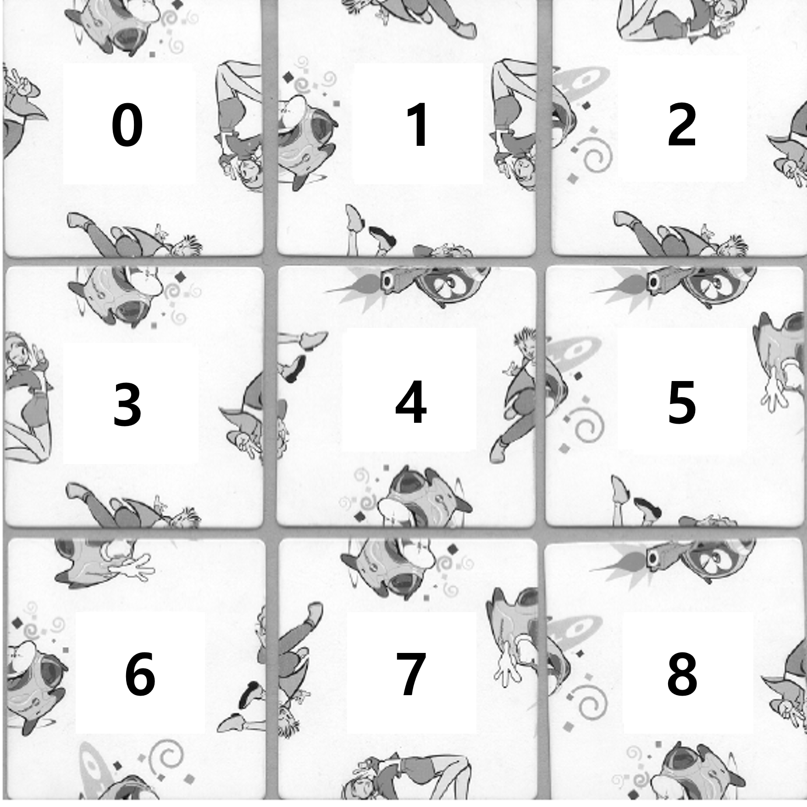
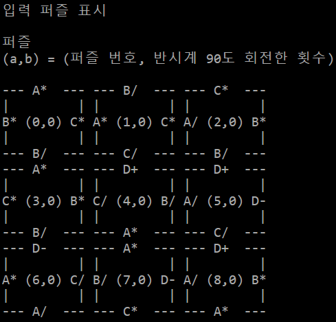
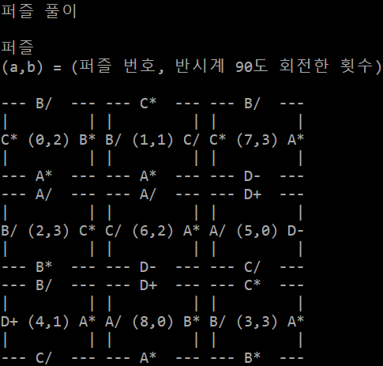
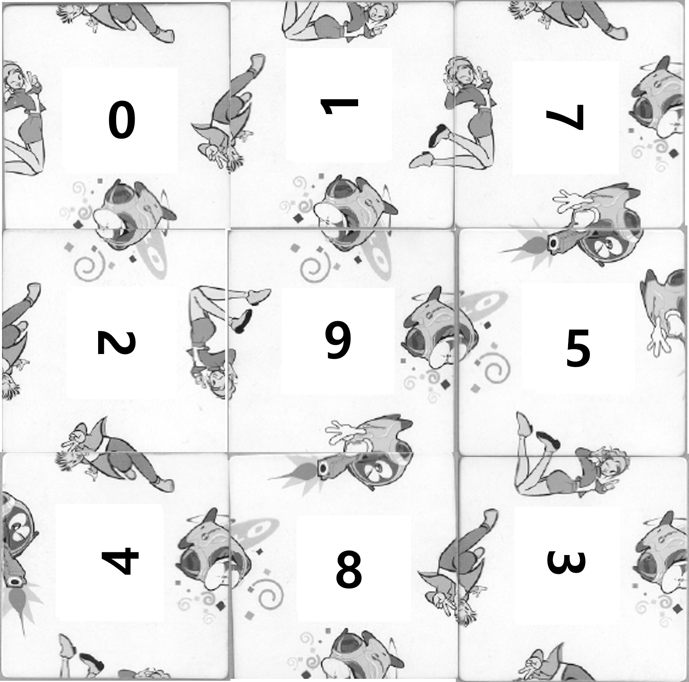
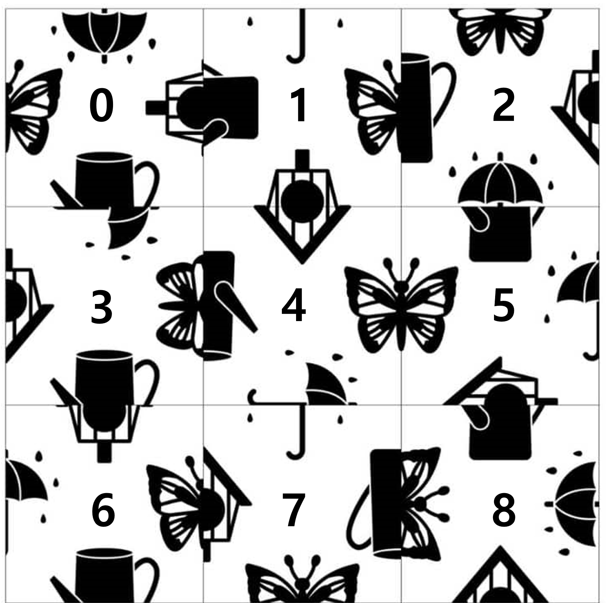
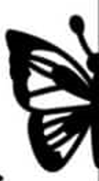
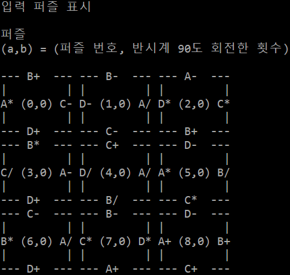
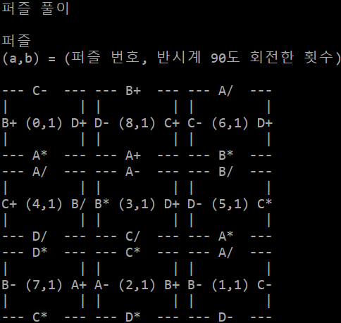
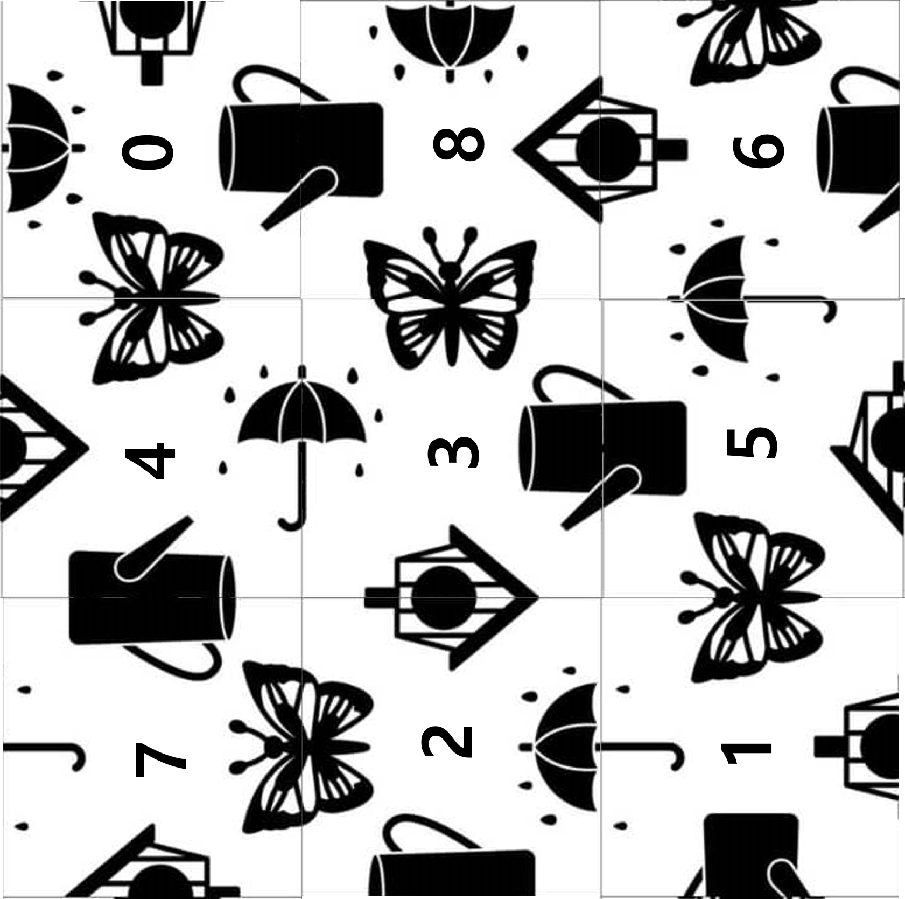
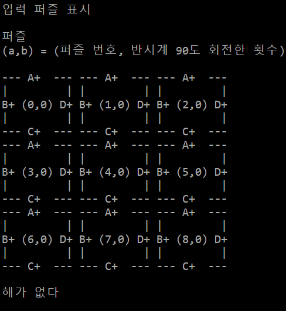

## **HW3 보고서 2020203090 한용옥**
## **실행환경**
### **언어 : `c++20`**
### **컴파일러 및 IDE : Microsoft Visual Studio Community 2022 버전 17.13.6**

## **퍼즐 모델링 방법 및 텍스트 표현**

### **퍼즐의 기본 구조**

제공된 퍼즐은 3x3 크기의 격자로 구성되어 있으며 각 칸에는 퍼즐 조각이 배치된다 각 퍼즐 조각은 네 방향(북, 서, 남, 동)에 그림이 있으며 이 그림들이 인접한 조각의 그림과 맞아떨어져야 퍼즐이 완성된다

### **그림 종류와 분할 방식**

**그림 종류**
조각에는 총 4종류의 그림이 사용되며 이를 알파벳 `A, B, C, D`로 모델링하였다

**분할 방식**
각 그림은 두 가지 방식으로 분할될 수 있다
1. **위/아래 분할** : 그림이 위쪽과 아래쪽으로 나뉘어짐
2. **좌/우 분할** : 그림이 왼쪽과 오른쪽으로 나뉘어짐

### **16가지 표식**

그림 `4` 종류(`A, B, C, D`)와 분할 방식 `2` 가지(위/아래, 좌/우)를 조합하면 총 16가지의 서로 다른 표식이 가능하다 이를 텍스트로 모델링하기 위해 다음과 같은 표기법을 사용하였다

1. 그림 종류는 알파벳(`A`, `B`, `C`, `D`)으로 표시
2. 분할 방식과 위치는 특수 기호로 표시
    |  | 위쪽 | 아래쪽 | | 왼쪽| 오른쪽|
    |--:|:--:|:--:|--:|:--:|:--:|
    | 위 아래 분할 | `+` | `-` | 좌 우 분할 | `*` | `/` |

따라서 16가지 표식은 다음과 같이 구성
- `A+, A-, A/, A*`
- `B+, B-, B/, B*`
- `C+, C-, C/, C*`
- `D+, D-, D/, D*`

### **퍼즐 텍스트열 구성법**

퍼즐의 각 조각은 `4`개의 방향(북, 서, 남, 동)을 가지며, 각 방향에는 위에서 설명한 `16`가지 표식 중 하나가 배치된다 퍼즐 조각들을 텍스트로 표현할 때는 다음과 같은 규칙을 따른다

1. 각 퍼즐 조각은 한 줄로 표현됨
2. 한 줄에는 4개의 표식이 순서대로 나열(북, 서, 남, 동 방향 순)
3. 각 표식은 그림 종류(알파벳)와 분할 기호로 구성됨

예를 들어 ppt의 첫 번째 퍼즐의 `0` 번째 조각은 `A* B* B/ C*` 로 표현된다 

이는 다음을 의미한다
- 북쪽 방향: `A*` (`A` 그림의 오른쪽 부분)
- 서쪽 방향: `B*` (`B` 그림의 오른쪽 부분)
- 남쪽 방향: `B/` (`B` 그림의 왼쪽 부분)
- 동쪽 방향: `C*` (`C` 그림의 오른쪽 부분)

### **짝 맞음 규칙**

짝이 맞음은 다음 두 조건을 모두 만족함을 의미한다

1. 그림 종류(알파벳)가 동일
2. 분할 기호가 서로 짝이어야 함
   - `+`와 `-`는 서로 짝이다(위/아래 분할의 위쪽과 아래쪽)
   - `/`와 `*`는 서로 짝이다(좌/우 분할의 왼쪽과 오른쪽)

**예시** : (`A+`, `A-`), (`B/`, `B*`), (`C+`, `C-`), (`D/`, `D*`) 는 서로 짝이다

### **퍼즐 매칭 규칙**

퍼즐을 맞추기 위해 인접한 두 조각의 맞닿는 면의 그림들은 짝이 맞아야 한다

## **풀이 및 코드 분석**

### **상수 및 방향 정의**

|상수|값|설명|
|:--:|:--:|:--|
|`N`,`W`,`S`,`E`|0,1,2,3|퍼즐 조각의 네 방향(북, 서, 남, 동)을 나타내는 인덱스|
|`PUZ_ROW`,`PUZ_COL`|3,3|퍼즐의 행과 열 크기|
|`PIECE_COUNT`|9|퍼즐 조각의 총 개수|
|`PAINT_COUNT`|16|가능한 표식의 총 개수|
|`PAINT_TYPE`|2|각 표식의 구성 요소 수(알파벳과 기호, 2개)|
|`PAINT_CONTAIN`|4|각 조각이 가진 그림의 수(4면)|
|`SHIFT_TYPE`|4|회전 가능한 방향의 수(90도씩 4방향)|

### **그림 표현 (= 표식)**

```cpp
array<char, PAINT_TYPE>
```
그림은 위의 표식 규칙에 맞게 텍스트로 인코딩된다 길이는 `2`로 고정이므로 고정 `char` 배열로 표식을 저장한다

### **퍼즐 조각 표현**

```cpp
class piece {
private:
```
조각을 `piece` 클래스로 표현하였다 다음은 `private` 멤버 변수이다

```cpp
int number;
```
몇 번 째 조각인지 저장한다

```cpp
size_t shift_count;
```
몇 번 반시계 회전했는지 저장한다

```cpp
array<array<array<char, PAINT_TYPE>, PAINT_CONTAIN>, SHIFT_TYPE> state;
```
퍼즐 조각의 그림 표식을 저장하는 3차원 배열

- 첫 번째 차원: 회전 상태(`0 ~ 3`, 0°, 90°, 180°, 270° 순서)
- 두 번째 차원: 방향(북, 서, 남, 동 순서)
- 세 번째 차원: 그림 표현

회전된 모든 상태를 미리 계산하여 저장함으로써 실행 시간에 회전 계산을 반복하지 않게 위 배열에 상태를 저장하였다

아래는 `public` 멤버 함수이다
```cpp
public:
    void set_number(int n) { number = n; }
```
클래스 필드 설정함수이다 `number`를 설정한다

```cpp
void set_state(int s_idx, char first, char second) {
    for (size_t shift = 0; shift < SHIFT_TYPE; shift += 1) {
        size_t col = (s_idx + shift) % PAINT_CONTAIN;
        state[shift][col][0] = first;
        state[shift][col][1] = second; } }
```
`s_idx` 는 동서남북 중 하나이다 표식을 받아 `state`의 `s_idx` 방향 자리 원소로 설정한다
`state`는 3차원 배열로 미리 모든 회전의 결과를 가지는데 이 함수는 모든 회전 경우에 맞는 인덱스에 `first`, `second`로 만든 표식을 저장한다

```cpp
int get_number() const { return number; }
size_t get_shift_count() const { return shift_count; }
```
클래스 필드를 가져오는 함수이다 `number`, `shift_count`를 가져온다

```cpp
const array<char, PAINT_TYPE>& get_state(size_t direction) const
{
    return state[shift_count][direction];
}
void shift() { shift_count = (shift_count + 1) % SHIFT_TYPE; } }; //class piece end
```
`shift` 는 필드 `shift_count`를 증가시켜 회전한 것 같은 효과를 준다
`get_state`는 `shift_count`에 맞게 회전된 상황에 맞게 `state`의 첫 번째 인덱스를 선택해 `direction` 방향의 그림을 가져온다

### **조각 배열, 퍼즐 배열 표현**

퍼즐 조각과 퍼즐 보드를 표현하기 위해 전역 배열을 사용

```cpp
array<piece, PIECE_COUNT> piece_arr;
array<array<piece*, PUZ_COL>, PUZ_ROW> puzzle;
```
`piece_arr` 은 퍼즐에 사용될 `9`개의 조각을 저장한다
`puzzle` 은 `3 * 3` 

백트래킹 과정에서 여러 함수가 동일한 퍼즐 상태에 접근해야 하므로, 전역 변수로 선언하여 매개변수 전달의 복잡성을 줄였다
`puzzle` 배열은 실제 조각 객체가 아닌 포인터를 저장하여 메모리 사용을 줄이고 조각 배치/제거 시 객체 복사 없이 포인터 할당만으로 처리할 수 있다

### **퍼즐 입력 방법**

퍼즐 텍스트열 구성법에 따라 변환된 그림(`9 * 4` 표식)을 콘솔 입력으로 받는다
아래와 같이 작동한다

1. 한 줄 입력 받음
2. `4`개 표식으로 `set_state` 를 이용해 `piece_arr` 의 상태 초기화
3. `9`번 반복하며 `piece_arr` 의 모든 원소의 상태 초기화

따라서 `piece_arr`에 사용할 `9`개의 조각의 상태가 입력 텍스트 열에 의해 채워진다

### **퍼즐 출력 방법**

각 퍼즐 조각의 번호와 회전 상태 표시, 각 조각의 네 방향(북, 서, 남, 동)에 있는 표식 출력, 퍼즐 조각 간의 경계와 여백을 `ASCII` 아트로 표현

### **백트래킹 전략**

퍼즐은 모든 경우의 수를 봐야하므로 백트래킹을 사용한다

### **퍼즐의 상태 공간 트리**

퍼즐 문제의 상태 공간 트리는 다음과 같은 특징을 가진다

1. **루트 노드** : 빈 퍼즐 보드 (아직 조각이 배치되지 않은 상태)
2. **내부 노드** : 일부 위치에 조각이 배치된 부분 해
3. **리프 노드** : 모든 위치에 조각이 배치된 완전한 해 또는 더 이상 진행할 수 없는 상태
4. **간선**     : 조각 배치 또는 회전 등의 상태 전이

퍼즐 조각은 `4`개의 회전 상태를 가지고 조각은 `9`개이므로
각 노드에서는 다음과 같은 선택이 가능하다
- 어떤 조각을 선택할 것인가? (`9`개 조각 중 아직 사용하지 않은 조각)
- 선택한 조각을 어떻게 회전시킬 것인가? (`4`가지 회전 상태)

따라서 각 노드에서 최대 `36`개의 자식 노드가 가능하며, 트리의 깊이는 `9`(퍼즐 보드의 위치 수)이다

```
상태 공간 트리
노드 = [보드 좌표 : 조각 번호 : 회전상태]   보드 좌표 = (i, k) [0 <= i, k <= 8]
조각 번호 = n [0 <= n <= 8]               회전 상태 = s [0 <= s <= 3]

                            [루트 = 빈 보드]
                      /       |            \        \
           [(0,0):1:0] [(0,0):1:1] ... [(0,0):5:2]..[(0,0):8:3]
              /   \
   [(0,1):0:0]... [(0,1):8:3] .....
```

### **가지치기 전략**

퍼즐의 제한 없는 모든 가능한 경우의 수는 $4^9 \cdot 9!$ 이다 즉 리프노드도 그만큼 되므로 일반적으로 다 보기는 어렵다 `promising` 개념을 사용해 상태공간 트리를 가지치기 한다 또한 트리를 `DFS`로 탐색하고 정답 경로가 발견된 즉시 멈춰 불필요한 연산을 멈춘다

### `promising`

#### **퍼즐 개형**

| | | |
|:--:|:--:|:--:|
|0 |1 |2 |
|3 |4 |5 |
|6 |7 |8 |

퍼즐 규칙에 따라 인접한 면의 짝이 맞아야한다 퍼즐 개형에 맞게 규칙을 정리하면 다음과 같다

- 퍼즐 바깥면과 접하는 곳은 어떤 표식이 와도 된다
- 인접한 면의 표식이 맞아야한다

`DFS`로 상태공간 트리를 탐색하기 때문에 조각은 `0, 1, 2, 3, 4, 5, 6, 7, 8, 9` 순으로 채워진다 이를 고려한 `promising` 은 다음과 같다

`i` 번째 조각이 채워질 때

- `i == 0`
처음 채워지는 것이므로 `promising`

- `i == 1 OR i == 2`
이때는 밑에 조각이 없고 왼쪽의 조각만 맞닿으므로
왼쪽 조각의 동쪽 면과 넣을 조각의 서쪽 면이 맞아야 `promising`

- `i == 3 OR i == 6`
이때는 오른쪽에 조각이 없고 위쪽의 조각만 맞닿으므로
위쪽 조각의 남쪽 면과 넣을 조각의 북쪽 면이 맞아야 `promising`

- 나머지
왼쪽 조각과도 맞닿고 위쪽 조각과도 맞닿는다 따라서 왼쪽 조각의 동쪽 면과 넣을 조각의 서쪽 면, 위쪽 조각의 남쪽 면과 넣을 조각의 북쪽 면이 맞아야 `promising`

### **구현**

### **짝맞음 구현**

```cpp
bool piece_pair_promising(const array<char, PAINT_TYPE>& a, const array<char, PAINT_TYPE>& b) {
```
두 표식을 받아 짝이 맞는지 검사한다 맞으면 `true`, 틀리면 `false`를 반환한다

```cpp
if (a[0] != b[0]) return false;
bool check = (a[1] == '+' && b[1] == '-') || (a[1] == '-' && b[1] == '+') ||
                (a[1] == '*' && b[1] == '/') || (a[1] == '/' && b[1] == '*');
return check; }
```
표식의 첫 글자는 그림 종류이다 그림 종류가 다르면 짝이 안맞는 것이므로 검사해서 `false`를 반환한다
표식의 두 번째 글자는 분할 조각 이다 짝 맞음 규칙에 맞게 검사하여 결과를 내보낸다 교환법칙이 성립하게 구현하였다

### **`promising` 구현**

```cpp
bool puzzle_piece_promising(piece* target, int num) {
```
백트래킹의 `promising` 을 검사하는 함수이다 퍼즐에 들어갈 조각 `target` 과 몇 번째 조각인지에 대한 `num`을 받은 후 검사 한 뒤, `promising` 이면 `true`, 아니면 `false`를 반환한다

```cpp
    if (num == 0) return true;
```
빈 퍼즐에 처음 들어가는 조각이면 `promising` 이므로 `true` 반환한다

```cpp
    size_t row = num / 3, col = num % 3;
```
퍼즐은 `3 * 3` 이차원 배열로 구현되었기 때문에 인수로 받은 순서로 인덱스를 결정한다

```cpp
if (num == 1 || num == 2) {
    piece* compare = puzzle[row][col - 1];
    return piece_pair_promising(target->get_state(W), compare->get_state(E)); }
```
왼쪽 조각의 동쪽 면과 넣을 조각의 서쪽 면을 검사하여 `promising` 인지 반환한다

```cpp
else if (num == 3 || num == 6) {
    piece* compare = puzzle[row - 1][col];
    return piece_pair_promising(target->get_state(N), compare->get_state(S)); }
```
위쪽 조각의 남쪽 면과 넣을 조각의 북쪽 면을 검사하여 `promising` 인지 반환한다

```cpp
else {
    piece* compare1 = puzzle[row][col - 1];
    piece* compare2 = puzzle[row - 1][col];
    return piece_pair_promising(target->get_state(W), compare1->get_state(E)) &&
            piece_pair_promising(target->get_state(N), compare2->get_state(S)); } }
```
왼쪽 조각의 동쪽 면과 넣을 조각의 서쪽 면, 위쪽 조각의 남쪽 면과 넣을 조각의 북쪽 면을 검사하여 `promising` 인지 반환한다

### **백트래킹 구현**

```cpp
bool backtracking(int puzzle_num, int remain_piece) {
```
전체 백트래킹 과정을 담당하는 함수이다 사용할 조각과 조각을 배치할 퍼즐은 전역변수이므로 인수로 받지 않는다
`DFS`탐색 방식이 목적이므로 재귀함수로 구현하였다 몇 번째로 배치한 퍼즐인지에 대한 `puzzle_num` 과 퍼즐에 배치하고 남은 조각에 대한 `remain_piece` 를 인수로 받는다
재귀함수의 최종 반환은 해가 있으면 `true` 없으면 `false` 다

```cpp
if (puzzle_num == 9) return true;
```
재귀 기저에 해당하는 부분이다 재귀함수는 `promising`을 검사하며 배치하므로 이를 다 통과하고 `9`개가 배치되었다면 그 상태가 해이다 따라서 `true`를 반환한다

```cpp
for (int p_i = 0; p_i < PIECE_COUNT; p_i += 1)
	if (remain_piece & (1 << p_i)) {
        piece* now = &piece_arr[p_i];
        size_t row = puzzle_num / 3, col = puzzle_num % 3;
```
상태공간 트리를 탐색하기 위해 남은 조각에 대해 연산을 반복하는 부분이다
백트래킹 과정에서 사용 가능한 조각을 추적하기 위해 비트마스크를 사용하였다
`remain_piece` 의 하위 `9`비트 중 `1`로 설정 된 비트가 사용할 조각을 나타낸다
남은 조각을 선택하고 배치 순서인 `puzzle_num` 로 조각을 `puzzle` 에 배치할 인덱스를 결정한다

따라서 위 코드는 몇 번째 조각이 남았는지 검사하여 남았으면 그 조각으로 시작되는 상태 공간의 부분트리를 탐색시키는 코드이다

```cpp
    for (int shift = 0; shift < 4; shift += 1) {
```
조각은 회전이 가능하며 회전한 조각은 상태공간트리에서 다른 노드로 취급된다 따라서 위 코드는 특정 조각의  특정 회전상태로 시작되는 상태 공간의 부분트리를 탐색시키는 코드이다

```cpp
        if (puzzle_piece_promising(now, puzzle_num)) {
```
가지치기를 효과적으로 하기 위해 현재 조각이 `promising` 일 때만 다음 단계(재귀)를 진행한다
 
```cpp
            puzzle[row][col] = now;
            int mask = remain_piece & ~(1 << p_i);
            if (backtracking(puzzle_num + 1, mask)) return true;
            puzzle[row][col] = nullptr; }
        now->shift(); }  }
```

1. 위에서 결정한 인덱스에 현재 조각을 배치한다
2. 남은 조각인 `remain_piece` 에서 현재 조각을 없앤 마스크 `mask`를 만든다
3. 다음 번호와 `mask`로 재귀호출한다
4. 재귀호출의 값이 `true`면 해가 완성되었으므로 `true`를 반환하여 다음으로 가지 못하게 한다 이는 해를 하나만 찾는 효과를 낸다
5. 해가 없어 `4`번에서 끝나지 않으면 다음 탐색을 위해 현재 자리를 `nullptr`로 설정해 빈 자리임을 확실하게 한다

`promising` 일 때 위 `5` 개를 수행한다 수행이 완료되면 현재 조각을 회전시켜 회전에 대한 `for`문이 잘 작동하게 한다

```cpp
return false;
```
위 과정에서 탈출 못했으면 상태공간 트리를 전부 탐색했음에도 해의 경로를 발견 못한것이다 따라서 퍼즐 풀이법이 없는 경우이므로 `false`를 반환한다

```cpp
//main() 내부
int init = 511;
if (backtracking(0, init)) { cout << "\n퍼즐 풀이\n"; print_puzzle(); }
else cout << "\n해가 없다\n" << endl;
```

`main` 함수에서의 백트래킹 호출이다 `511`은 하위 `9`비트가 모두 `1`이므로 모든 조각을 사용할 수 있음을 나타낸다 `puzzle_num` 은 `0`을 줘서 아직 배치한 퍼즐이 없음을 나타낸다
반환값이 `true` 면 해가 있고 `puzzle`에 해가 저장되어있으므로 출력하고 `false` 면 해가 없다고 출력한다

## **과제 ppt의 예시 실행**

### **퍼즐 2, 3, 4, 5 는 모양만 다르고 배치는 동일하므로 퍼즐 1과 퍼즐 2만 풀이**

## **퍼즐 1**

||
|:--:|
||
|퍼즐 1의 모습과 들어갈 순서(조각 번호)를 적었다|

### **그림에 대한 표식**

그림종류를 다음과 같이 나타내었다

| | | | |
|:--:|:--:|:--:|:--:|
|  ||||
|**A**|**B**|**C**|**D**|

### **텍스트 변환**

표식 규칙과 텍스트열 구성 규칙에 의해 퍼즐 `1` 의 텍스트열(프로그램의 입력)은 다음과 같다
```cpp
A* B* B/ C*
B/ A* C/ C*
C* A/ B/ B*
A* C* B/ B*
D+ C/ A* B/
D+ A/ C/ D-
D- A* A/ C/
A* B/ C* D-
D+ A/ A* B*
```

### **프로그램 실행**

|||
|:--:|:--:|
|||
|프로그램은 먼저 텍스트열의 입력을 시각화 한다|그 후 퍼즐의 해가 있으면 위와 같이 풀이된 퍼즐을 시각화 한다|

### **퍼즐 1 프로그램 풀이 시각화**

||
|:--:|
||

## **퍼즐 2**

||
|:--:|
||
|퍼즐 2의 모습과 들어갈 순서(조각 번호)를 적었다|

### **그림에 대한 표식**

그림종류를 다음과 같이 나타내었다

| | | | |
|:--:|:--:|:--:|:--:|
|  ||||
|**A**|**B**|**C**|**D**|

### **텍스트 변환**

표식 규칙과 텍스트열 구성 규칙에 의해 퍼즐 `2` 의 텍스트열(프로그램의 입력)은 다음과 같다
```cpp
B+ A* D+ C-
B- D- C- A/
A- D* B+ C*
B* C/ D+ A-
C+ D/ B/ A/
D- A* C* B/
C- B* D+ A/
B- C* A+ D*
D- A+ C+ B+
```

### **프로그램 실행**

|||
|:--:|:--:|
|||
|프로그램은 먼저 텍스트열의 입력을 시각화 한다|그 후 퍼즐의 해가 있으면 위와 같이 풀이된 퍼즐을 시각화 한다|

### **퍼즐 2 프로그램 풀이 시각화**

||
|:--:|
||


### **해가 없는 퍼즐에 대한 프로그램 실행**

||
|:--:|
||
|프로그램은 먼저 텍스트열의 입력을 시각화 한다 해가 없으므로 없다고 표시해준다|


